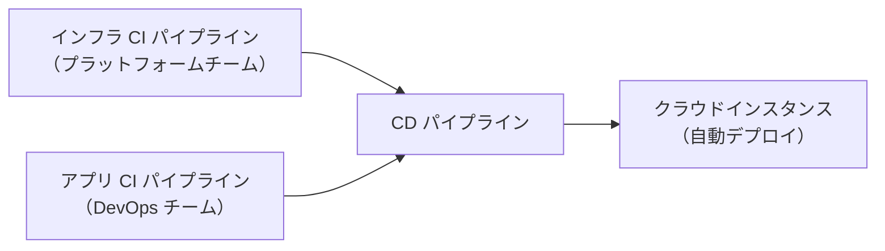

# BUILD-RUN-OPERATIONS.md

本ファイルは、セキュリティアーキテクチャの **Build フェーズ（開発・実装・保証）** と **Run フェーズ（セキュリティ運用）**、そして設計手法全体のふりかえりと反復について説明する。RAID ログの概念定義・ガバナンス上の位置づけは [COMPLIANCE-AND-GOVERNANCE.md](./COMPLIANCE-AND-GOVERNANCE.md) を参照。

← [SKILL.md へ戻る](../SKILL.md)

---

## 1. Build フェーズ：セキュリティを組み込んだ開発

### 1.1 開発プロセスとセキュリティの関係

情報システムの構成要素のほぼすべてが何らかのコード実装を伴う。要件定義→設計→実装→テスト→デプロイという一連のステップは **ソフトウェア開発ライフサイクル（SDLC）** と呼ばれる。脆弱性は存在ゼロを目指すより「リスク許容レベルまで低減し、継続的に維持すること」を目標とする。

**主要な開発モデルとセキュリティ摩擦**

| モデル | 特徴 | セキュリティ摩擦の所在 |
|--------|------|----------------------|
| ウォーターフォール | チームがサイロ化（開発・テスト・運用） | テストフェーズで初めてセキュリティ懸念が浮上。フェーズ間の調整コストが大きい |
| アジャイル | 多機能チーム・反復開発 | セキュリティ要件より機能要件が優先されやすい（可視性の差） |
| DevOps | 高度な自動化・継続的デリバリー | 自動化がゲートを排除するため、脆弱なコードが本番に到達しやすくなる |
| DevSecOps | セキュリティを SDLC に統合 | セキュリティが全員の責任として分散する → 専門家だけでは対処できない規模の問題を解決 |

**シフトレフト原則**: 問題の発見が遅いほど修正コストは増大する。設計・開発の早期にセキュリティ活動を組み込むことで、後工程での大規模修正を防ぐ。

### 1.2 セキュリティチャンピオン

開発チームのサイズと中央セキュリティチームのサイズには大きな差がある（例：開発者数千人に対しセキュリティ専門家は数十人）。スケールの問題を解決するために **セキュリティチャンピオン** を活用する。

セキュリティチャンピオンは、開発チームの中でセキュリティに親和性の高いメンバーが担う役割。中央セキュリティチームのサポートのもと、以下を提供する：

- 開発チームへのアプリケーションセキュリティ研修
- DevSecOps のフレームワーク設計と助言
- セキュリティ要件分析・脅威モデリング支援
- アプリケーションセキュリティテスト計画
- 脆弱性修正ガイダンス

### 1.3 SDLC 各フェーズのセキュリティ活動

#### 設計フェーズ

- 機能要件・非機能要件をバックログに蓄積し、リスクに基づいて優先順位を付ける
- **悪用ケース（abuse case）** を機能要件と対にして定義することで、ビジネスロジック攻撃の検出基盤を作る
  - 例：ゲートウェイ料金システムであれば「課金ロジックを操作してゼロ円課金を試みる」などの悪用シナリオを想定する
- 悪用ケースは対策要件（countermeasure requirement）の定義につながる

#### 開発フェーズ

- 言語別のセキュアコーディングガイドを整備する
- **SAST（静的アプリケーションセキュリティテスト）** ツールを IDE に統合し、開発段階で脆弱性を早期検出する
- ピアレビュー（コードレビュー）を必須化し、リスクベースでスコープを選択する（全コードのレビューは非現実的）
- コード変更のトレーサビリティを確保するために Git 等のリポジトリを活用する
- **生成 AI ツールの注意点**: AI が生成したコードは歴史的データに基づくため、必ずしもベストプラクティスに準拠していない。批判的な目でレビューすることが必須

#### ビルド・パッケージフェーズ

CI/CD パイプラインに組み込む主要な自動セキュリティテスト：

| テスト種別 | 略称 | 概要 |
|------------|------|------|
| 静的アプリケーションセキュリティテスト | SAST | ソースコードを静的解析してバッファオーバーフロー・SQL インジェクション等の脆弱性パターンを検出 |
| ソフトウェア構成解析 | SCA | 利用しているオープンソースコンポーネントの脆弱性・ライセンス違反を検出。SBOM（ソフトウェア部品表）の生成・管理に活用 |
| シークレットスキャン | — | ソースコード・コンテナイメージ・IaC にハードコーディングされたパスワード・API キーを検出 |
| セキュア設定チェック | — | コンテナイメージと設定が組織のセキュリティポリシー・ハードニングガイドラインに準拠しているか検証 |

ビルド成果物はアーティファクトリポジトリに保存し、テスト・ステージング・本番への自動デプロイに使用する。

#### デプロイ・テスト・リリースフェーズ

本番稼働前に複数サイクルのセキュリティ保証活動と是正措置の時間を確保する。セキュリティアーキテクト（またはセキュリティチャンピオン）は、テスト戦略・計画にセキュリティ保証活動を確実に含める責任を持つ。

**テスト戦略（Test Strategy）の主要要素**

| 要素 | 内容 |
|------|------|
| 目標とスコープ | テストの全体目標と範囲を明確化 |
| リスク分析 | テストプロセスへのリスク特定と優先順位付け |
| 入口・出口条件 | テスト開始/完了の判断基準 |
| テストレベルと種類 | 単体・統合・システム・受入テスト等の種類と実施基準 |
| テスト実行戦略 | テストケース実行の順序・頻度 |
| メトリクスと測定 | テストの有効性・進捗の指標と収集方法 |

**テスト計画（Test Plan）の主要要素**

| 要素 | 内容 |
|------|------|
| テストリソース | 役割・責任・必要スキル・研修 |
| スケジュール | マイルストーン・依存関係・全体スケジュールとの整合 |
| テスト自動化戦略 | 自動化対象テストケースとツール・フレームワーク選定基準 |
| 欠陥追跡・報告 | 欠陥の記録・追跡・報告プロセス |
| テスト環境 | インフラ・ソフトウェア・ネットワーク構成（本番環境に近いほど良い） |
| テストデータ | 本番データ利用のリスクを避けるため、スクランブル処理や合成データ生成（生成 AI 活用）を検討 |

### 1.4 V モデルとセキュリティ保証活動

V モデルは開発フェーズと対応するテストフェーズを V 字形で示し、要件から設計・実装・テストまでの **トレーサビリティ** を担保する。

```
要件定義        ────────────────────    受入テスト
  システム仕様    ──────────────    システムテスト（侵入テスト）
    高・低レベル設計  ──────    統合テスト（DAST・IAST）
      コーディング  ────    単体テスト（SAST）
```

各テストフェーズで使用するセキュリティテスト技術：

- **SAST**（静的）: ビルド時にソースコード解析
- **DAST**（動的アプリケーションセキュリティテスト）: 実行中のアプリケーションへの入力を解析
- **IAST**（インタラクティブ）: ランタイム監視によりランタイム条件下でのみ顕在化する脆弱性を検出
- **侵入テスト**: 手動・自動を組み合わせた倫理的ハッキング

**主要アシュアランス活動（Day-0/Day-1/Day-2 の区分）**

| 活動 | Day-0/1 | Day-2 |
|------|---------|-------|
| 文書化・承認済みソリューション | 必須 | 変更のたびに |
| プロセス・手順・作業指示の文書化 | 必須 | 変更のたびに |
| 要件トレーサビリティ | 必須 | 変更のたびに |
| 機能・非機能テスト | 必須 | 変更のたびに |
| サプライチェーンリスク評価 | 必須 | 定期実施 |
| 脆弱性管理 | 必須 | 定期実施 |
| 倫理的ハッキング（侵入テスト） | 必須（重要システム） | 定期実施 |
| 継続的設定モニタリング | 必須 | 定期実施 |

---

## 2. RAID ログの Build 段階実運用

> 🔗 RAID（Risks, Assumptions, Issues, Dependencies）の概念定義とガバナンス上の位置づけは [COMPLIANCE-AND-GOVERNANCE.md](./COMPLIANCE-AND-GOVERNANCE.md) を参照。本セクションでは Build フェーズにおける実際の運用方法に焦点を当てる。

RAID ログはプロジェクトチーム全員が日常的に記録・更新するものであり、プロジェクトマネージャーだけが管理するツールではない。アーキテクチャ設計の議論・ベンダーとの交渉・システム仕様のレビューなど、あらゆる場面で RAID アイテムが生まれる。

**Build フェーズで RAID アイテムが発生しやすい状況**

- デプロイアプローチの決定（例：MVP 先行でセキュリティ要件の後回しリスク）
- 外部セキュリティサービスへの依存関係（例：SOC の SLA 未合意）
- インフラが先行してセキュリティ設計が間に合わない問題（Issue）
- 既存の DevOps プロセスがセキュリティプラクティスを含んでいるという仮定（Assumption）

**RAID ログの QA チェックリスト（Build 段階）**

リスク（R）
- このリスクはすでに発生しているか？→ 発生済みなら Issue に変更する
- オーナーが明確で、プロジェクトの適切なフェーズまでに緩和策が実施されるか確認

前提（A）
- ソリューションの承認前に前提を検証できるか確認
- 検証できない場合は、未検証のリスクを「リスク」として登録しオーナーに承認を求める

課題（I）
- これはまだ発生していない可能性か？→ 未発生なら Risk に変更する
- プロジェクトの適切なフェーズまでに解決できない場合はリスクとして登録

依存関係（D）
- すべての依存関係に契約または内部合意による責任が明記されているか確認
- 本番稼働前にすべての依存関係の合意をカバーしているか確認

---

## 3. クラウドセキュリティ運用モデル

クラウド活用が組織内で拡大するにつれ、ガバナンスなき採用（設定誤りによるデータ公開・アクセス権の放置・コンプライアンス違反等）のリスクが高まる。**クラウドセキュリティ運用モデル** は人・プロセス・技術の枠組みでこれらのリスクを管理する。

**主要機能と責任**

| 機能 | 主な責任 |
|------|---------|
| CISO オフィス | セキュリティポリシー発行・リスク管理・セキュリティ投資管理・CSPM・SIEM 導入 |
| エンタープライズアーキテクチャ（EA） | クラウド参照アーキテクチャがエンタープライズアーキテクチャ戦略に沿っているか検証 |
| クラウドセンターオブエクセレンス（CCoE） | セキュリティコントロールフレームワーク確立・アーキテクチャパターン定義・ランディングゾーン設計・ベンダー選定基準の策定 |
| プラットフォームチーム | 認定済みセキュリティ製品・設定のクラウドマーケットプレイスへの提供、インフラパイプラインの整備 |
| DevOps チーム | パイプラインと認定済み製品・設定を使用してソリューションを実装 |

**CI/CD パイプラインの多層構成**



本番クラウドインスタンスへの直接手動介入を排除し、すべての変更を自動化されたパイプライン経由で行うことが原則。

---

## 4. セキュリティ運用（Run フェーズ）

### 4.1 責任共有 RACI / RASCI

各セキュリティサービスの Provider（サービス提供者）と Consumer（利用者）の責任を明確化するために RACI テーブルを使用する。

**RACI の役割定義**

| 記号 | 意味 |
|------|------|
| R（Responsible） | 活動を実際に実行する責任者 |
| A（Accountable） | 実行ではなく成果に対して最終説明責任を持つ者 |
| C（Consulted） | 実行に際して意見を求める者 |
| I（Informed） | 活動について通知を受ける者 |

複数チームが同一活動を担当する場合は **RASCI** に拡張する：R（主導責任）+ **S（Supporting：支援責任）**。これにより「誰が主導し誰が支援するか」が明確になる。

**RACI 活用のポイント**
- 外部セキュリティサービスには契約に RACI を組み込む
- 内部セキュリティサービスには内部合意として文書化する
- **一方的な責任共有合意（one-sided）** に注意：一方だけが責任を文書化し、もう一方が未記載の内容をすべて自分の責任と思い込む状況を避ける

### 4.2 プロセス・手順・作業指示の3層構造

大規模組織でコントロールを一貫して実行するには、技術・部門を超えた抽象化レイヤーが必要：

| レイヤー | 組織スコープ | 定義 | 記述内容 |
|---------|------------|------|---------|
| **プロセス** | エンタープライズ全体 | **何を**行い、なぜ行うか | スイムレーン図または高レベルフローチャート。技術依存なしで役割・活動・制御ポイント・職務分掌を定義 |
| **手順** | 事業部門またはアプリケーション | プロセスを**どう**実行するか | 業務固有のステップを追加した詳細手順（ただしコマンドレベルの詳細は含まない） |
| **作業指示** | 特定技術またはアプリケーション | 手順を**具体的にどうやって**実行するか | 特定コマンド・パラメータ・IP アドレス・設定値を含む操作手順 |

小規模組織では3層を1〜2層にまとめることも現実的。重要なのはコントロールの一貫した実行と監査証跡の記録。

### 4.3 プロセス文書化の手法

**状態遷移図（Statechart Diagram）**

情報ライフサイクルの状態変化を視覚化する。例：脆弱性管理では「新規発見 → レビュー → 是正/リスク受容 → クローズ」の各状態とトリガーを表現。各状態変化は手動・自動混在のプロセスで実現される。

**スイムレーン図（Level 1 / Level 2）**

- Level 1 プロセスフロー：複数のサブプロセスの連鎖（全体像）
- Level 2 プロセスフロー：各サブプロセスをスイムレーンで役割別に分解

**プロセス説明テーブル**
スイムレーン図に記載しきれない詳細（判断基準・監査証跡の記録内容）をテーブル形式で補足する。推奨フォーマット：

| フィールド | 内容 |
|-----------|------|
| アクティビティ ID | プロセス番号（例：VM-7.3.1） |
| タイトル | アクティビティの短い名称 |
| 役割 | 担当役割 |
| 説明 | 詳細な実行手順と判断基準。監査証跡に記録すべき内容も明記 |

**職務分掌マトリクス（Separation of Duties Matrix）**

特定の役割が実行できる活動の組合せを明示。高リスクの組合せ（禁止）・低リスクの組合せ（推奨されないが例外あり）・許可される組合せを区別する。

---

## 5. 脅威検知ユースケース

脅威モデリングで特定されたすべての脅威が完全に緩和できるわけではない。緩和困難な脅威、新たな脆弱性の発見、検知によるリスク認識が目的の場合に **脅威検知ユースケース** を定義する。

**検知ユースケースの種類**

| 種類 | 特徴 |
|------|------|
| **汎用ユースケース** | 多くのインフラ・ワークロードに広く適用可能。最小限の設定で動作するが、ソリューション固有の追加設定が必要な場合がある |
| **ワークロード固有ユースケース** | 特定のアプリケーション・ワークロードに特化。新規開発を要する場合が多い |

汎用ユースケースをまず活用し、独自ユースケースの開発はその後に行う。

**検知ユースケースの構成要素**

| 要素 | 説明 |
|------|------|
| タイトル | 検知機能を端的に表す名称 |
| 説明 | 検知対象の脅威と検知方法。理解度に応じて概念レベル〜技術詳細レベルで記述 |
| 根拠（Rationale） | ユースケースの背景：対象アプリ・処理データの機密性・影響を受けるビジネスプロセス。優先順位付けに使用 |
| 要求者 | 要求元の識別子（追加確認や完了後の統合テストで連絡が必要） |
| 検知ルール | 1つまたは複数のルール（名称/説明/イベントソース/イベントフィールド/例外/スコープ/注記） |

**脅威検知の情報源（公開標準）**

- **OWASP Foundation Top Ten**: 開発者が警戒すべき代表的な弱点リスト
- **MITRE CWE（Common Weakness Enumeration）**: より包括的な弱点分類
- **NIST NVD / MITRE CVE**: 既知脆弱性データベース
- **MITRE ATT&CK**: 脅威アクターの戦術・技法の知識ベース

---

## 6. インシデント対応ランブック

脅威検知サービスがアラートを発した場合に対応するプロセスを **インシデント対応ランブック** として定義する。対応ライフサイクルは NIST SP 800-61r2 のフレームワークを基盤とする：

| フェーズ | 概要 |
|---------|------|
| **準備** | ソリューションアーキテクチャの開発・ハードニング・セキュリティテスト・検知・対応サービスの展開。インシデント対応プロセスの教育とテスト |
| **識別（検知・分析）** | 脅威検知サービスのアラート調査・偽陽性か否かの判断・インシデントレコードへの記録 |
| **封じ込め** | 脅威の拡散防止。高度な攻撃者の場合、封じ込めがデータ破壊を誘発するリスクも考慮して次フェーズに進む判断を行う |
| **根絶** | 脆弱性除去・悪意あるコードの削除・シークレット/暗号鍵/パスワードの全変更 |
| **回復** | サービスの回復・インフラの再デプロイ。本番復帰前の緊急セキュリティ改善を検討 |
| **事後活動** | 教訓の抽出・検知精度の改善・長期的セキュリティ強化プロジェクトの立ち上げ |

**インシデント対応チームの階層**

| 階層 | 役割 |
|------|------|
| Tier 1（ファーストレスポンダー） | アラートの初期確認・偽陽性判断・インシデントレコードへの情報収集。AI 支援による自動トリアージが進展 |
| Tier 2（インシデントレスポンダー） | 詳細調査・封じ込めの実施。影響範囲が限定的なインシデントを担当 |
| Tier 3（重大インシデントレスポンダー） | 組織横断的な重大インシデントの指揮・調整。フォレンジック調査も担当 |
| Tier 4 / CSIRT | リーダーシップ・承認機能。法務・広報・データプライバシーチームとの調整。主要な変更の承認 |

**ランブックの構成要素**

ヘッダー（タイトル・説明・紐づく検知ユースケース）＋ 各フェーズの活動テーブル（活動番号・説明・担当 Tier）。テーブルに RACI を組み込んでチーム間のハンドオーバーを明示する。

**アーキテクトとして確認する事項**
- ソリューションの必要なログがインシデント対応チームに提供されるか
- インシデント中に必要な自動化をソリューションに組み込んでいるか
- 外部に流出したデータは回収不能（複製済みの前提）であることを想定した設計か

---

## 7. 脅威トレーサビリティマトリクス

脅威モデリングから検知ユースケース・インシデント対応ランブックまでの **完全なカバレッジ** を一覧化するマトリクス。

| 脅威 ID | 脅威 | 検知 ID | 検知ユースケース | 対応 ID | インシデント対応ランブック | テスト ID |
|---------|------|---------|---------------|---------|-------------------------|---------|
| T01 | （脅威名） | C01.1 | （検知ユースケース名） | IR01 | （ランブック名） | Test_IR_001 |

- 脅威 1件に対して検知ルールが複数ある場合は行を拡張する
- ID と名称を分けることで、フィルタリングと追跡が容易になる

---

## 8. 継続的アーキテクチャとふりかえり

### 8.1 セキュリティの基礎チェックリスト

複雑な設計を行う前に、以下の基礎的なコントロールでリスクの大部分を除去できる：

- **サポート済みソフトウェアの使用**: セキュリティパッチの入手可能性を確保。オープンソースも含む
- **脆弱性へのパッチ適用**: ソフトウェア資産の把握とリスクに応じたパッチ適用タイムライン設定
- **ソフトウェアのハードニング**: 不要サービスの無効化・デフォルトパスワード変更・強力なパスワードポリシー・転送中/保存時の暗号化
- **多要素認証（MFA）の使用**: 認証情報漏洩リスクを大幅に低減
- **管理者権限の制限**: 特権アカウントを日常業務に使用しない。業務上必要な最小限の権限のみ付与
- **データのバックアップ**: ランサムウェア等の被害に備えた定期バックアップ（保存場所・鮮度・テストも重要）
- **従業員セキュリティ教育**: フィッシング・ソーシャルエンジニアリング・安全なブラウジング習慣の啓発

### 8.2 最小限アーティファクトから始める

すべてのアーティファクトを最初から作成する必要はない。**2つの最小限アーティファクト** から始めることを推奨：

1. **アーキテクチャ決定記録（ADR）**: アーキテクチャ思考の成果である設計決定を記録する（→ [ARTIFACT-METHOD.md](./ARTIFACT-METHOD.md)）
2. **脅威モデル**: データフローの脅威と対策を特定する（→ [THREAT-MODELING.md](./THREAT-MODELING.md)）

これら2つを起点に、システムコンテキスト図・コンポーネントアーキテクチャ図・RAID ログを順次追加し、アーティファクトの「キットバッグ」を拡充していく。

### 8.3 成熟度モデルによる反復的改善

基礎コントロールが整ったら、**防御深化（Defense in Depth）** のための多層コントロールへと進む。成熟度モデルの活用手順：

1. **参照フレームワークの選択**: NIST CSF・ISO/IEC 27001 等の公開フレームワーク。多くのフレームワークが CMMI の5段階（Initial→Managed→Defined→Quantitatively Managed→Optimizing）を参照している
2. **目標成熟度の定義**: 最高レベルを目指す必要はない。組織規模・業界・リスク許容度が目標を決める
3. **現状評価**: 文書レビュー・インタビュー・システム評価で現状の成熟度レベルを特定
4. **活動計画**: ギャップに基づくロードマップを作成。一度に2段階以上の改善は困難なため段階的に計画する

### 8.4 セキュリティ・コスト・ユーザビリティ・レジリエンスのバランス

| 軸 | 考慮点 |
|----|--------|
| **セキュリティ（リスク低減）** | コントロールのリスク低減効果がコストを上回るか評価。効果のないコントロールは除外する |
| **コスト** | 技術・サービス選定が実装コストと運用コストを決定する |
| **ユーザビリティ** | 人は最小抵抗の経路を選ぶ。複雑すぎるコントロールは回避行動を生む。セキュリティで UX を低下させないことを最低目標とする |
| **サイバーレジリエンス** | 侵害は起こりうると仮定する（Zero Trust の原則）。検知・封じ込め・復旧の速度を KPI で計測する |

**サイバーレジリエンスの主要 KPI**

| KPI | 定義 |
|-----|------|
| MTTD（Mean Time to Detect） | インシデントを検知するまでの平均時間 |
| MTTC（Mean Time to Contain） | 検知から脅威を封じ込めるまでの平均時間 |
| MTTR（Mean Time to Resolve） | 検知から完全復旧までの平均時間 |

### 8.5 セキュリティサイロの打破

セキュリティが後付けになる最大の原因はサイロ化：
- アプリケーションアーキテクト・インフラアーキテクト・セキュリティアーキテクトが別々に設計する
- セキュリティチーム内部でも脆弱性管理チームと脅威管理チームが分断している

解決策：**アーキテクチャ思考の始めからセキュリティを統合する**。RACI でセキュリティサービス間の責任を明確にし、ソリューションがほかのサービスとどう統合するかを常に考慮する。

### 8.6 AI とセキュリティアーキテクチャ

**セキュリティのための AI 活用**
- SIEM：AI による誤検知低減と文脈情報の自動付加
- SOAR：インシデントサマリー生成・緩和策の提案・対応の自動化

**AI 固有の脅威（設計時に考慮）**

| 脅威 | 概要 |
|------|------|
| データポイズニング | 学習データを改ざんしてモデルの出力を意図的に歪める |
| モデル窃取 | クエリを通じてモデルのアーキテクチャ・パラメータを抽出 |
| プロンプトインジェクション | 悪意ある入力でモデルのガードレールを回避し意図しない動作を誘発 |
| AI サプライチェーン攻撃 | GPU・ML ソフトウェアスタック・モデル自体のサプライチェーンへの侵害 |

対策：入力/出力の監視・AI ファイアウォール（ガードレール）導入・SIEM/SOAR による継続的モニタリング・AI ガバナンス（公平性・バイアス・モデルドリフトの管理）。

---

## 9. QA チェックリスト

**Build フェーズ**
- [ ] CI/CD パイプラインに SAST・SCA・シークレットスキャン・セキュア設定チェックが組み込まれているか
- [ ] テスト戦略とテスト計画にセキュリティ保証活動が含まれているか
- [ ] V モデルに基づく各フェーズの対応テストが定義されているか
- [ ] RAID ログが最新状態に保たれ、オーナーが各アイテムを処理しているか

**Run フェーズ**
- [ ] セキュリティサービスごとに RACI/RASCI が定義されているか
- [ ] 外部サービスには契約、内部サービスには内部合意として RACI が組み込まれているか
- [ ] プロセス→手順→作業指示の3層（または適切な統合）が整備されているか
- [ ] プロセスに状態遷移図・スイムレーン図・職務分掌マトリクスが揃っているか
- [ ] 脅威モデリングの各脅威に対して検知ユースケースが定義されているか
- [ ] 検知ユースケースに対してインシデント対応ランブックが対応づけられているか
- [ ] 脅威トレーサビリティマトリクスで完全カバレッジを確認したか
- [ ] ソリューションのログがインシデント対応チームに提供される設計になっているか

**継続的改善**
- [ ] 基礎コントロール（パッチ適用・MFA・管理者権限制限・バックアップ等）が実施されているか
- [ ] 成熟度モデルを使った現状評価と目標設定が行われているか
- [ ] セキュリティ・コスト・ユーザビリティ・レジリエンスのバランスをレビューしているか
- [ ] AI を活用したソリューションでは GenAI 固有の脅威（データポイズニング・プロンプトインジェクション等）を脅威モデルに含めているか
