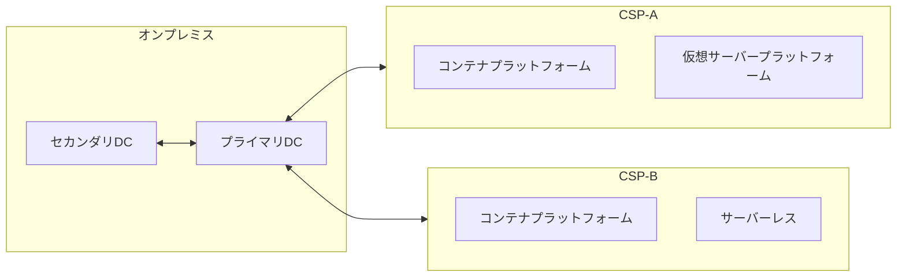
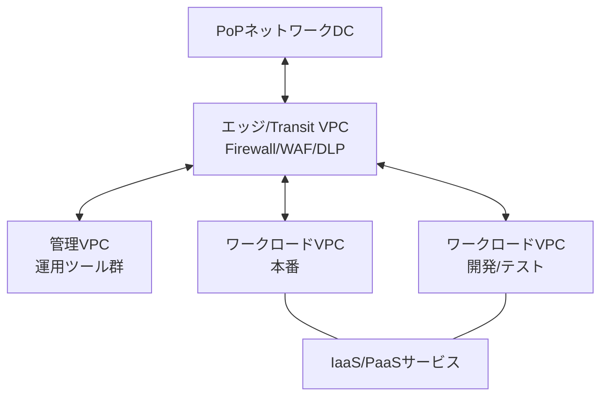

# クラウドインフラセキュリティとアーキテクチャパターン

ハイブリッドクラウド環境における責任共有モデルの定義方法、デプロイメントアーキテクチャの設計技法、ネットワークセグメンテーション、再利用可能なセキュリティパターン、そしてアーキテクチャ決定記録（ADR）の運用を解説する。

← [SKILL.md へ戻る](../SKILL.md)

---

## 1. 責任共有モデル

### 1.1 クラウドサービスモデルと責任範囲

クラウドサービスモデルによって、CSPと利用者の責任範囲は大きく異なる。

| モデル | CSP責任範囲 | 利用者責任範囲 |
|--------|------------|--------------|
| **IaaS** | 物理ハードウェア・ネットワーク・ストレージ | OS・ミドルウェア・アプリケーション・セキュリティ設定 |
| **PaaS** | IaaS + ミドルウェア・DB・実行環境の運用 | アプリケーション・設定・アクセス管理 |
| **SaaS** | IaaS + PaaS + アプリケーション機能 | 設定・データ・アクセス管理 |

> **重要**: SaaSでも利用者にはセキュリティ設定の責任が残る。「CSPに任せていれば安全」という誤解を避けるために責任共有スタック図を活用する。

### 1.2 クラウドプラットフォームの種別

ハイブリッドクラウド環境では複数のプラットフォームが共存する。各プラットフォームで責任境界が異なる。

| プラットフォーム | サービス分類 | 特徴 |
|----------------|------------|------|
| ベアメタルサーバー | IaaS | 専用物理ハードウェア。高パフォーマンス・高規制要件向け |
| 仮想サーバープラットフォーム | IaaS | 物理サーバーを仮想化。柔軟性と俊敏性を提供 |
| コンテナプラットフォーム | PaaS | Kubernetes等でコンテナをオーケストレーション |
| サーバーレスプラットフォーム | PaaS | イベント駆動の関数実行。インフラ管理不要 |

### 1.3 ランディングゾーン

ランディングゾーン（クラウドファンデーションとも呼ぶ）は、安全でコンプライアンスに適合したクラウド環境を構築・管理するための実践集である。以下の要素から構成される。

- **原則 (Principles)**: 意思決定の指針（耐障害性・セキュリティ・コスト最適化など）
- **ポリシー (Policies)**: 組織が遵守するルール（セキュリティ・データプライバシーなど）
- **プラクティス (Practices)**: 実証済みのアーキテクチャ・構築・運用アプローチ
- **プロセスと手順**: 運用の一貫性を確保するプロセス定義
- **エンタープライズパターン**: 多数のワークロードを扱う大規模組織向けのクラウド組織モデル
- **アーキテクチャパターン**: 特定ワークロードの構築ベストプラクティス
- **レジリエンシーパターン**: 可用性要件を実現するための設計パターン
- **デプロイメント自動化**: IaCによる繰り返し可能な展開

### 1.4 ハイブリッドクラウドアーキテクチャ

ハイブリッドクラウドはオンプレミスのデータセンターと複数のパブリック/プライベートクラウド環境を統合した単一インフラである。利用者はワークロードの特性に応じて最適な環境を選択できる。



マルチクラウド利用時も「ハイブリッドクラウド」として扱う。各ランディングゾーンは異なる責任共有構成を持つ。

### 1.5 責任共有スタック図

責任共有スタック図は、ハイブリッドクラウド環境の各プラットフォームについて、層ごとの責任帰属を視覚化する。

**スタックのレイヤー（下から上）**

| レイヤー | 説明 |
|---------|------|
| ロケーション | プライマリ・セカンダリ・DRロケーション（オンプレミス・クラウド） |
| プラットフォーム名 | 技術プラットフォームの識別（例: コンテナプラットフォーム v4） |
| 物理ロケーション | オンプレミスDCまたはCSPデータセンター |
| 物理ハードウェア | 計算・ストレージ・ネットワーク・HSM |
| ファウンデーションサービス | CSPのアカウント管理・IAMなど基盤サービス |
| 組み込みクラウドサービス | IaaS/PaaSサービス（ネットワーク・ストレージ・DB等） |
| 追加構築機能（Built-on） | 組み込みサービス上に構築された機能（組織が設置・運用） |
| アプリケーションコンポーネント | ワークロードを構成するコンポーネント群 |

**責任区分の例（CSP責任レベル）**

| 区分 | 意味 |
|------|------|
| Install | インストールのみ。以降の運用は利用者 |
| Install and Operate | インストールと基本運用をCSPが担当。設定は利用者 |
| Physical Install and Operate | 物理ハードウェアの設置・運用をCSPが担当 |
| Full Service | 利用者から完全に隠蔽されたサービス |

### 1.6 セキュリティポリシーの責任帰属

データの安全管理に対する**説明責任 (accountability)** は、保存場所がオンプレミスでも CSPでも、常にデータ所有者（利用者組織）が負う。

一方、CSPは「境界以下」のプラットフォームセキュリティに対して**責任 (responsibility)** を持つ。利用者はCSPの保証活動（コンプライアンスレポート・独立監査）を通じてCSPのコントロール有効性を確認する。

### 1.7 責任共有QAチェックリスト

- [ ] ワークロードが使用するすべての計算プラットフォームを識別したか
- [ ] 機密データを扱う外部SaaSサービスを列挙したか
- [ ] 各プラットフォームのCSP/インフラ管理/セキュリティ運用/アプリケーション管理の責任帰属を記録したか
- [ ] 各インフラプラットフォームのプライマリ・セカンダリ・DRロケーションを確認したか

---

## 2. インフラセキュリティとデプロイメントアーキテクチャ

### 2.1 デプロイアーキテクチャの種類

ハイブリッドクラウド環境では2種類のアーキテクチャ図を組み合わせる。

| 成果物 | 目的 |
|--------|------|
| **デプロイアーキテクチャ図 (DAD)** | オンプレミス・クラウドの両方を含む技術非依存の統合図。高レベル設計では論理図、詳細設計では規定図で記述する |
| **クラウドアーキテクチャ図 (CAD)** | 特定のCSP記号を用いたCSP固有のリソース配置図 |

シーケンス図・コラボレーション図もこの段階で活用できる（認証フローの詳細記述など）。

### 2.2 インフラセキュリティ設計の3ステップ


#### ① 機能コンポーネントの配置

コンポーネントアーキテクチャ図を参照し、各機能コンポーネントを共有責任図のプラットフォームに割り当てる。可能な場合はPaaSサービスを優先する。ロケーション選定はレイテンシー・データ主権・耐障害性要件に基づく。

#### ② コンプライアンス要件の組み込み

非機能要件（セキュリティ・可用性・パフォーマンス）を取り込みアーキテクチャを精緻化する。

- 既存のセキュリティサービス（脅威監視・脆弱性管理・アクセス管理）との統合点を確認する
- 組織のセキュリティ標準・ハードニング要件を適用する
- 可用性要件とセキュリティ要件が競合する場合、早期にトレードオフを検討する

#### ③ データフローの保護

4種類の通信パターンを体系的に検証する。

| フロー種別 | セキュリティ要件の要点 |
|-----------|----------------------|
| **① 人間/システムアクター → 計算ノード** | 相互認証付きTLS（レガシー対応が必要な場合はIPSec） |
| **② 計算ノード → 計算ノード** | 相互認証付きTLS。保存データはBYOKまたはHSM連携の暗号化を検討 |
| **③ 計算ノード → クラウドサービス** | 相互認証付きTLS、保護されたAPI、IAMコントロール、プライベートエンドポイントを優先 |
| **④ クラウドサービス → クラウドサービス** | CSP内通信も暗号化要件を確認。設定変更が利用者の管理範囲にある部分を特定する |

> **ポイント**: すべてのデータフローを検証する必要はない。アーキテクチャ的に重要なフロー（セキュリティ判断に影響するもの）を優先する。バッチイベント・タイマートリガーのフローも忘れずに列挙する。

### 2.3 ネットワークセグメンテーション

#### パブリッククラウドのネットワークセグメンテーション

CSPはソフトウェア定義ネットワーキング（SDN）を提供する。利用者は仮想ネットワークをCSP固有のプログラマブルオーバーレイネットワークで構成し、サブネット・VPC・セキュリティグループ・ACLを設定する。

#### マイクロセグメンテーション

1つのネットワークセグメント内でのラテラルムーブメントを防ぐために、アプリケーション単位の「バブル」を形成し、バブル内外のトラフィックをポリシーで制御する。

- クラウドネイティブSDNのACLに加え、第三者製マイクロセグメンテーションソリューションを重ねることで、CSP横断のポリシー一元管理が可能
- トラフィックフロー分析に基づくポリシー提案機能を持つソリューションが有用

#### ネットワークエッジ保護

インターネットと内部ネットワーク間には引き続きファイアウォールが必要。

| 役割 | 解説 |
|------|------|
| **NextGenファイアウォール** | L7対応。WAF・DLP機能を組み込む場合と、専用アプライアンスに分離する場合がある |
| **WAF（Webアプリケーションファイアウォール)** | L7でHTTPトラフィックを検査 |
| **サイト間VPN / SD-WAN** | データセンターとクラウドインスタンス間の接続。追加のファイアウォールで補強する場合もある |

### 2.4 デプロイアーキテクチャのQAチェックリスト

- [ ] システムコンテキスト図のすべてのアクターへの通信経路がDADに反映されているか
- [ ] コンポーネントアーキテクチャのすべてのコンポーネントが配置されているか
- [ ] アーキテクチャ的に重要なすべてのデータフローにセキュリティコントロールが設定されているか

---

## 3. アーキテクチャパターン

### 3.1 N層アーキテクチャ

3層（プレゼンテーション・アプリケーション・データ）から発展したN層構造は、クラウド環境でのデフォルト設計パターンである。

各層を独立したネットワークセグメントに配置し、ファイアウォールで境界を保護することで、攻撃者のラテラルムーブメントを抑止する。クラウドでは、グローバルロードバランサー・メッセージングストリーム・多様なデータストアが加わり、層の数が増えるN層になる。

### 3.2 ルートtoライブ環境

開発・テスト・本番環境を独立したN層コピーとして構築し、段階的に昇格させる。

```
開発 → テスト → ステージング（プリプロダクション） → 本番
```

- 環境間は完全に分離し、テスト環境の変更が本番に影響しないよう設計
- 本番データをテスト環境に持ち込まない
- 各環境を自動化で構築することで、一貫性と俊敏性を確保

### 3.3 ハブ&スポークアーキテクチャ



| コンポーネント | 役割 |
|--------------|------|
| **エッジ/Transit VPC** | North-Southトラフィックの集中管理。WAF・DLPを配置 |
| **管理VPC** | 開発・テスト・運用ツール群を収容。複数VPCに分割することが多い |
| **ワークロードVPC** | N層 × ルートtoライブのアプリケーション環境 |
| **IaaS/PaaSサービス** | 各VPCのワークロードが消費するクラウドネイティブサービス |

Transit VPCはクラウド内だけでなく、PoPネットワークDCやオンプレミスDCにホストすることも可能。複数のCSPやオンプレミスをまたぐ場合に有効。

### 3.4 レジリエントハブ&スポーク

開発/テスト環境と本番環境の Transit VPC・管理VPCを分離する。

```
本番系: Transit VPC(本番) + 管理VPC(本番) + ワークロードVPC(本番)
開発テスト系: Transit VPC(開発) + 管理VPC(開発) + ワークロードVPC(開発/テスト)
```

これにより、開発環境での変更が本番への経路に影響しなくなり、セキュリティインシデントの本番への波及を防止できる。

### 3.5 独立セキュリティアプライアンス

クラウドプラットフォームに組み込みのセキュリティ機能（VPCネットワークセキュリティ）に加え、ベンダー独立のNextGenファイアウォールを重ねる選択肢がある。

- **メリット**: 防御の多層化。クラウドプロバイダーとセキュリティ専門ベンダーの技術を組み合わせることで、プラットフォームレベルの脆弱性に対する独立した防御層を提供
- **デメリット**: 設置・運用コストの増加。専門スキルが必要
- **判断基準**: セキュリティ運用チームのスキルセットとリソース状況を考慮する

### 3.6 デプロイ可能アーキテクチャ（IaC自動化）

企業規模ではACLルールが数万件規模になるため、手動管理は現実的でない。アーキテクチャをコードとして定義し、自動化で展開する。

```
DVCS（Git等）→ CI/CDパイプライン → IaCツールチェーン → クラウドインフラ
```

| コンポーネント | 役割 | 代表ツール |
|--------------|------|-----------|
| **DVCS** | インフラコードのバージョン管理・協調作業 | Git / GitHub / GitLab |
| **CI/CDパイプライン** | ビルド・テスト・デプロイの自動化。設定ミス・脆弱性スキャンを実施 | Jenkins / Tekton / Travis CI |
| **IaCツールチェーン** | インフラをコードで宣言的または命令的に定義・プロビジョニング | Terraform / Ansible / CloudFormation |

CSPは独自のデプロイ可能アーキテクチャカタログを提供している（well-architectedフレームワーク・リファレンスアーキテクチャ）。これらをベースに組織固有の要件を加えてカスタマイズし、内部パターンとして公開・再利用する。

---

## 4. アーキテクチャ決定記録（ADR）

### 4.1 ADRを記録する理由

設計中に行うアーキテクチャ決定は、将来のコスト・拡張性・制約に大きな影響を与える。ADRに記録することで：

- 新規参加メンバーが過去の決定理由を理解できる
- 同じ議論の繰り返しを防止する
- ステークホルダーとの合意と説明責任を文書化できる
- 感情的な議論を客観的なオプション比較に昇華できる

### 4.2 ADRの書式

#### 長文形式 ADR

複数の選択肢の比較が必要な重要な決定に使用する。

| 項目 | 内容 |
|------|------|
| 対象領域 | 関心領域の特定 |
| 決定タイトル | 決定の概括的なタイトル |
| 説明 | 問いの形で決定事項を明示 |
| 問題の記述 | 背景と課題の概要 |
| 前提条件 | 問題コンテキストについての仮定 |
| 動機 | なぜこの決定が重要か |
| 代替案 × N | 説明・利点・欠点・コスト |
| 決定 | 採択した選択肢 |
| 正当化 | 採択理由 |
| 影響 | 決定がもたらす結果 |
| 派生要件 | 決定から生まれる新たな要件 |
| 関連決定 | 関連するADRへの参照 |

#### 短文形式 ADR

影響範囲が小さく理解しやすい決定に使用する。「ID / 決定内容 / 根拠 / 影響」の4列で記述する。

```markdown
| ID   | 決定内容 | 根拠 | 影響 |
|------|---------|------|------|
| AD01 | PaaSサービスを優先利用 | CSPへの運用委託によりスキル不足リスクを低減 | PaaSの可用性・コンプライアンス要件の確認が必要 |
```

### 4.3 意思決定の階層

| スコープ | 決定タイプ | 例 |
|---------|----------|----|
| エンタープライズ | アーキテクチャ指導原則 | マネージドサービスをオープンソースより優先 |
| プログラム | アーキテクチャ決定 | エージェントレス技術を優先 |
| プロジェクト | 設計決定 | 統合セキュリティアプライアンスを採用 |

上位の原則は下位の決定を制約する。原則から逸脱する場合はADRに逸脱理由を記録する。

### 4.4 ADRの管理方法

| 手段 | 特徴 |
|------|------|
| ドキュメント/スプレッドシート | 静的な記録。変更履歴が追いにくい |
| Kanbanボード | Agile環境に適合。議論の過程を追跡可能 |
| Gitリポジトリ + 静的サイト | プルリクエストによるレビューと変更追跡。カタログとして参照しやすい |

### 4.5 ADR QAチェックリスト

- [ ] 既存のADRが今回の提案に優先する可能性を確認したか
- [ ] 重要なアーキテクチャ選択をADRとして記録したか
- [ ] 複数の反対意見がある場合は長文形式を使用したか
- [ ] すべてのADRをソリューションアーキテクチャ文書またはプログラムADRログに記録・承認したか
- [ ] 決定の影響をRAIDログに起票したか

---

## 関連リファレンス

| ファイル | 内容 |
|---------|------|
| `SYSTEM-CONTEXT-AND-COMPONENTS.md` | システムコンテキスト図・コンポーネントアーキテクチャ（本ファイルの入力） |
| `ZERO-TRUST-ARCHITECTURE.md` | Zero Trust原則の詳細（ネットワーク設計の背景原則） |
| `COMPLIANCE-AND-GOVERNANCE.md` | コンプライアンスフレームワーク・エンタープライズセキュリティ（コンプライアンス要件の詳細） |
| `BUILD-RUN-OPERATIONS.md` | CI/CDセキュリティ・セキュア開発ライフサイクル（デプロイ可能アーキテクチャの実運用） |
