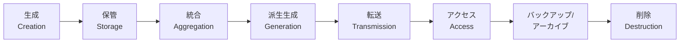

# DATA-CENTRIC-SECURITY.md

データ中心セキュリティの考え方を基礎から実践まで解説する。情報資産の特定・分類・ライフサイクル管理、Zero Trust との接点、保管/転送/使用中のデータ保護技法、情報資産登録簿（Information Asset Register）の作成手順を扱う。システムコンテキスト図や作図技法は [SYSTEM-CONTEXT-AND-COMPONENTS.md](./SYSTEM-CONTEXT-AND-COMPONENTS.md) を参照。

← [SKILL.md へ戻る](../SKILL.md)

---

## 1. データ中心セキュリティの考え方

情報セキュリティの本質的な目的は「データを守ること」であり、特定の技術機能を実装することではない。組織とその顧客のデータを保護することで、組織の信頼・評判・法規制遵守といった重要な側面が守られる。

**データ中心セキュリティのアプローチ**:

1. システム境界を流れるデータを特定する
2. 感度に基づいてデータを分類する
3. ポリシーに基づいて必要なセキュリティコントロールを定義する
4. 本当にビジネス価値のあるものを優先して保護する

このアプローチにより、情報セキュリティは「コスト」ではなく「戦略的優位性」として機能する。

---

## 2. 情報資産の特定と資産クラス

### 2.1 情報資産の価値

組織にとってのデータの価値が、実装すべきセキュリティコントロールの水準を決定する。まず組織にとって重要なデータを特定し、保護が必要なデータを識別するための**資産クラス（asset class）**を定義する。

**代表的な資産クラスの例**:

| 資産クラス | 概要 | 備考 |
|-----------|------|------|
| 核心情報資産（Crown Jewels） | 組織にとって最も価値の高い情報資産。漏洩・改ざん・利用不能が事業継続に直結する | 処理・分析によって生成された派生データも含まれる |
| 個人情報（PI）| 個人を特定しうるが、漏洩しても取り返しのつかない損害を直接引き起こさない程度のデータ（例: 氏名・住所） | — |
| 機密個人情報（SPI） | 漏洩が当事者に取り返しのつかない損害を与えうる個人情報。民族的出自・政治的意見・宗教的信条・労働組合活動・身体的・精神的健康・犯罪記録・性生活に関する情報を含む | 多くの個人データ保護規制で特別保護対象に指定されている |
| 財務情報 | 個人または法人の財務記録（銀行記録・税務記録・会計記録等） | 法規制対象になる可能性が高い |

> **実践ポイント**: 組織固有の資産クラス一覧が存在しない場合は、担当するシステム向けに自ら定義する。明確な資産クラスがあることで、プロジェクト内でのデータ価値の共通認識が生まれる。NIST SP 800-160 Vol. 1 の資産分類も参考になる（政府システム向けだが汎用的なヒントを提供する）。

### 2.2 情報資産登録簿（Information Asset Register）

情報資産登録簿は、システムで転送・処理・保管されるデータを体系的に識別・分類するための文書。解決する問題:

- 保護対象データの全体像を把握する
- データの感度に応じたセキュリティ対策の根拠を持つ
- 個人データ保護規制（GDPR 等）・PCI DSS といった法規制への準拠を確認する
- 要件の追跡可能性（トレーサビリティ）を確保する

---

## 3. データセキュリティライフサイクル

システム内でデータは**生成**から**消去**に至るライフサイクルを経る。ライフサイクルの各段階を理解することで、データがどこを流れ、どのように処理されるかを把握でき、各段階に適したセキュリティコントロールを設計できる。

### 3.1 8段階のライフサイクル

| 段階 | 説明 | セキュリティ上の注意点 |
|------|------|----------------------|
| 生成（Creation） | ユーザーがフォームに入力したり、センサーがデータを生成したりする | 入力バリデーション・発生源の認証 |
| 保管（Storage） | ディスク・データベース等での静的保管 | 保管時暗号化（at-rest encryption） |
| 統合（Aggregation） | 複数ソースのデータを1つのデータセットに統合 | 統合により感度が上昇する可能性がある（PI の集積が SPI に相当するケース等） |
| 派生生成（Generation） | 既存データの処理・分析から新たなデータを生成 | 生成後データの感度分類を再評価する |
| 転送（Transmission） | ネットワーク経路でのデータ移動 | 転送時暗号化（in-transit encryption）・転送中も一時保管が発生する点に注意 |
| アクセス（Access） | ユーザーがレポートを参照する・システムが計算を実行する等 | 最小権限の原則・アクセスログ |
| バックアップ/アーカイブ | 復旧・コンプライアンス・履歴保存を目的とした中・長期保管 | バックアップ先の暗号化・バックアップデータへのアクセス制御 |
| 削除（Destruction） | ストレージからのデータ除去・セキュア消去 | データ保持ポリシーに従ったセキュアな消去（単なる削除では不十分な場合がある） |

> **重要**: データセキュリティのコントロールは**すべての段階**で設計・実装する必要がある。データの感度と分類に応じて、各段階のコントロール水準を決定する。

### 3.2 ライフサイクルを活用した設計の考え方

- **バックアップとサイバー回復**: データを保管するシステムはバックアップ・アーカイブ・サイバー回復機能が必要。これに対応するための人的アクター・システムアクターを検討する
- **トランザクション処理由来のデータ**: ユーザーのアクションだけでなく、タイマーイベントやバッチ処理で生成されるデータも把握する

---

## 4. メタデータとそのリスク

データの処理・分析から生まれる**派生データ**がメタデータ。メタデータにはデータ自体に関する情報が含まれ、組織の事業基盤になりうる。

### 4.1 メタデータの種類

| 種類 | 概要 | 例 |
|------|------|-----|
| 記述的メタデータ（Descriptive） | コンテンツを説明するラベル情報 | タイトル・タグ・カテゴリ |
| 構造的メタデータ（Structural） | データの組織構造を記述 | 文書内の章立て・コレクションの構成 |
| 技術的メタデータ（Technical） | データの技術的特性 | ファイルサイズ・フォーマット・解像度 |
| 管理的メタデータ（Administrative） | データ管理活動を支援する情報 | 最終更新日・セキュリティ分類・デジタル権限管理情報 |

### 4.2 メタデータのリスク

- メタデータが組織・顧客に関する情報を保護できなければ、機密情報漏洩のリスクになる
- 場合によってはメタデータが**元データよりも機密性の高い「核心情報資産（Crown Jewels）」**となり、元データを超えたセキュリティコントロールが必要になる
- 検索機能や AI を提供する組織では、メタデータが事業の根幹をなすことがある

---

## 5. Zero Trust とデータフロー

Zero Trust アーキテクチャはデータ保護のための厳格なコントロールの基盤となり、機密データへの不正アクセスを継続的に監視する。

### 5.1 Zero Trust 設計原則のデータフローへの適用

- **「侵害を前提とする（Assume Breach）」原則**: コントロールはデータにできるだけ近い場所に配置する。他のシステムが既に侵害されている可能性を前提とする
- **すべてのアクセスを認証・認可**: デバイス・サービス・ユーザーを問わず、リソースへのアクセスには事前の認証と認可が必要
- **データフローの継続的監視**: ユーザー・デバイスの通常行動パターンを把握し、脅威を示す異常なアクティビティを検出する

### 5.2 データ分類との連携

データ分類アプローチと Zero Trust を組み合わせることで：

1. 適用すべきセキュリティコントロールの範囲をデータ感度に基づいて決定できる
2. 複数ビジネスプロセスを横断的に検討することで、Zero Trust ソリューションの数を削減できる
3. 実装コストの低減・デリバリー速度の向上・継続的サポートコストの削減が期待できる

---

## 6. データ分類体系

データ分類は **CIA トライアド**（機密性・完全性・可用性）の各観点から行う。

### 6.1 機密性（Confidentiality）分類

機密性分類は、データが漏洩した際のインパクトに基づいて定義する。

| 分類 | 概要 | コントロールガイダンス |
|------|------|----------------------|
| **公開（Public）** | 一般公開されており、漏洩しても組織・顧客への影響がない情報（例: 公開 Web サイトのコンテンツ） | セキュリティコントロール不要 |
| **内部（Internal）** | 全従業員が利用できるが外部公開しない情報（例: 社内手続き案内・内部向けコンテンツ）。漏洩の影響は限定的 | 社内ネットワーク内での保管。個人認証は必須ではないが内部境界制御が必要 |
| **機密（Confidential）** | 漏洩が組織に損害を与えうるが法規制違反には至らない情報（例: 製品ロードマップ草案・内部戦略文書） | 個人識別・認証によるアカウンタビリティ確保、ロールベースアクセス制御。転送時・保管時の暗号化必須 |
| **極秘（Highly Confidential）** | 漏洩が組織・顧客に深刻な損害（法的制裁・多額の罰金を含む）を引き起こす情報（例: 顧客の機密個人情報・認証情報） | Confidential の対策に加え、データベースの個別列単位（カラム単位）での暗号化またはトークン化が必要。特権管理者であっても閲覧不可とする |

> **注意**: Zero Trust を採用する組織では Internal 分類であってもネットワーク境界に依存せず、認証ベースのコントロールを採用することを推奨する。

### 6.2 完全性（Integrity）分類

データの完全性が損なわれた場合のインパクトに基づいて分類する。改ざんによる損害は軽視されがちだが、財務取引の不正変更や AI モデルへの不正介入のように深刻な影響をもたらすケースがある。

| 分類 | 概要 | コントロールガイダンス |
|------|------|----------------------|
| **低リスク** | 完全性が損なわれても組織への影響が最小限（例: 公開情報・非重要な履歴データ） | — |
| **中リスク** | 中程度の影響（例: 顧客の連絡先情報の一部） | 入力値バリデーション（電話番号の形式チェック等の簡易コントロール） |
| **高リスク** | 重大な影響（例: 機密個人情報・法的文書・営業秘密） | ハッシュによる改ざん検出 |
| **重大リスク** | 組織運営に致命的な影響（例: 財務取引記録・医療記録・個人識別番号） | 暗号署名による改ざん検出。特権管理者による改ざんも検出できるレベルの保護が必要 |

### 6.3 可用性（Availability）分類

ビジネスプロセスの可用性が失われた際のインパクトで分類する。クラウドネイティブ化に伴い、認証・認可サービスのような基盤セキュリティサービスの可用性要件は、過去より格段に高くなっている（認証情報が数分ごとに変わる環境では、IAM システムの停止が即座に事業影響を生む）。

| カテゴリ | 影響度 | 年間可用性目標 | RTO | RPO |
|---------|--------|--------------|-----|-----|
| **A（ミッションクリティカル）** | 停止が組織の存続に直結（例: 決済システム・重要インフラ制御システム） | 99.999% | 0 | ≒ 0（データ損失なし） |
| **B（高影響）** | 停止が業務に高い影響（例: 在庫管理システム・夜間バッチ処理） | 99.99% | 2時間 | ≒ 0（データ損失なし） |
| **C（中程度の影響）** | 停止が業務に中程度の影響（例: 顧客サービスデータベース・週次財務処理） | 99.9% | 48時間 | 2時間 |
| **D（低影響）** | 停止が業務に軽微な影響（例: 社内サポートシステム・補助的業務アプリ） | 99% | 72時間 | 24時間 |

**可用性の計算（Nines Availability）**:

| 可用性 | 年間停止許容時間 |
|--------|----------------|
| 99% | 87.6 時間 |
| 99.9% | 8.76 時間 |
| 99.99% | 52.45 分 |
| 99.999% | 5.26 分 |

- **RTO（Recovery Time Objective）**: ビジネスプロセスが停止してから業務影響が発生する前に復旧を完了しなければならない最大時間
- **RPO（Recovery Point Objective）**: 障害後に許容できるデータ損失量（どの時点まで遡って復旧できればよいか）

> **参考標準**: NIST FIPS 199「連邦情報および情報システムのセキュリティ分類の標準」も分類スキームの参考になる。

---

## 7. アクター×ユースケース×データのマッピング

システムコンテキスト（アクターと境界の特定）が完了したら、各アクターのユースケースと関連するデータを紐づけることで情報資産の全体像を把握する。

### 7.1 アクター×ユースケース×データ型マッピング表（例）

| アクター | ユースケース | 処理されるデータ型 |
|---------|------------|-----------------|
| **エンドユーザー** | 認証・ログイン | 識別・認証情報 |
| **エンドユーザー** | プロファイル登録・更新 | 連絡先情報・個人情報 |
| **エンドユーザー** | 決済処理 | 決済情報・取引履歴 |
| **サービスデスク担当者** | ユーザーサポート対応 | 顧客の連絡先情報・取引情報 |
| **システム管理者** | 運用・監視 | システムログ・設定情報 |
| **外部決済ゲートウェイ** | 決済仲介 | カード情報・取引データ |

> **補足**: ユースケースはユーザーストーリー・スイムレーン図・要件定義フェーズの成果物（[REQUIREMENTS-ENGINEERING.md](./REQUIREMENTS-ENGINEERING.md) 参照）と連携させる。タイマーイベントやバッチ処理で生成されるデータも含め、漏れなく列挙する。

### 7.2 情報資産インベントリの作成

アクター×ユースケース×データ型の分析を完了したら、それぞれのデータ型の機密性分類と法的・規制上の要件を整理する。

**情報資産インベントリの構成例**:

| データ型 | データフィールド例 | 機密性分類 | 法的・規制要件 |
|---------|-----------------|-----------|--------------|
| 識別・認証情報 | ユーザー名 | 機密（Confidential） | PI |
| 識別・認証情報 | パスワード | 極秘（Highly Confidential） | PI |
| 連絡先情報 | 氏名 | 機密（Confidential） | PI |
| 連絡先情報 | メールアドレス | 機密（Confidential） | PI |
| 決済情報 | クレジットカード番号 | 機密（Confidential） | PCI DSS |
| 決済情報 | セキュリティコード（CVV） | 極秘（Highly Confidential） | PCI DSS |
| 決済情報 | 請求先住所 | 機密（Confidential） | PI・PCI DSS |
| 決済ログ | 取引ログイベント | 機密（Confidential） | PCI DSS |

> **PI**: 個人情報。**PCI DSS**: Payment Card Industry Data Security Standard。

分類完了後、各データ型に対して転送時・保管時・処理時のセキュリティコントロール要件を導出し、システム要件に追加する。

---

## 8. 保管/転送/使用中のデータ保護

データは状態（State of Data）に応じて異なる保護が必要になる。

### 8.1 転送中のデータ（Data in Transit）

| 技術 | 適用場面 | 最低要件 |
|------|---------|---------|
| TLS（Transport Layer Security） | API・Web 通信・サービス間通信 | TLS 1.2 以上（1.3 を推奨。旧バージョンには既知の脆弱性が存在する） |
| VPN・専用線 | 拠点間・クラウド間の接続 | 暗号化トンネルを使用 |
| MQTT over TLS | IoT デバイス通信 | — |

### 8.2 保管時のデータ（Data at Rest）

| 機密性分類 | 推奨保護手段 |
|-----------|-----------|
| Public / Internal | 暗号化は必須でないが、媒体廃棄時のセキュア消去は実施 |
| Confidential | ファイルシステム・ボリューム・データベースの暗号化 |
| Highly Confidential | カラム単位・レコード単位の暗号化、またはトークン化・マスキングを追加。特権管理者も平文参照不可とする |

### 8.3 使用中のデータ（Data in Use）

| 技術 | 概要 |
|------|------|
| トークナイゼーション（Tokenization） | 機密データを参照トークンに置換し、原データをトークン化サービスで管理する。PCI DSS スコープ削減に有効 |
| マスキング（Data Masking） | テスト環境等で本番データを加工して機密性を除去する |
| コンフィデンシャルコンピューティング | 処理中（メモリ上）のデータを暗号化されたエンクレーブ内で処理する（Trusted Execution Environment） |
| 動的データマスキング（DDM） | データベースクエリの結果を権限に応じてリアルタイムに一部マスクして返す |

---

## 9. 情報資産登録簿 QA チェックリスト

情報資産登録簿の品質を確認するための項目:

- [ ] 各アクターのすべてのユースケースに関連するデータを識別したか
- [ ] タイマーイベント・バッチ処理・トランザクション処理が派生させるデータも含まれているか
- [ ] 組織の分類スキームに基づいてデータを分類し、法的・規制上の追加コントロールが必要なデータを識別したか
- [ ] 統合（Aggregation）や派生生成（Generation）により感度が上昇するデータを識別したか
- [ ] メタデータの機密性を評価し、元データより高い分類が必要かどうかを確認したか
- [ ] 分類に基づいて転送時・保管時・使用中のコントロール要件を導出したか
- [ ] 可用性分類に基づいて RTO・RPO の要件を定義したか

---

## 10. 関連参照

| 参照先 | 内容 |
|-------|------|
| [SYSTEM-CONTEXT-AND-COMPONENTS.md](./SYSTEM-CONTEXT-AND-COMPONENTS.md) | システムコンテキスト図の作図技法・アクターの特定・インターフェース記述 |
| [ZERO-TRUST-ARCHITECTURE.md](./ZERO-TRUST-ARCHITECTURE.md) | Zero Trust の基礎原則・コアコンポーネント・継続的認証 |
| [REQUIREMENTS-ENGINEERING.md](./REQUIREMENTS-ENGINEERING.md) | ユースケース・ユーザーストーリー・要件トレーサビリティ |
| [COMPLIANCE-AND-GOVERNANCE.md](./COMPLIANCE-AND-GOVERNANCE.md) | コンプライアンス管理・外部規制・ISO/IEC 27001・コントロールマッピング |
| [THREAT-MODELING.md](./THREAT-MODELING.md) | 脅威モデリングプロセス・データフロー図・コントロールの選択 |
