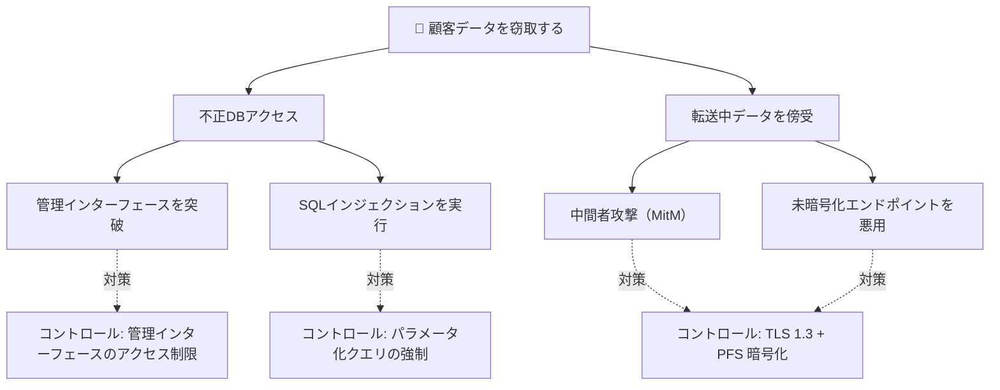

# THREAT-MODELING.md

セキュリティアーキテクチャ設計における脅威モデリングの実行プロセスを、信頼境界の特定からリスク優先順位付けまで一連の手順・表・チェックリストで提示する。  
← [SKILL.md へ戻る](../SKILL.md)

---

## 脅威モデリングとは

脅威モデリングは、システムへの潜在的な脅威・関連リスク・有効なコントロールを体系的に洗い出すプロセスである。セキュア・バイ・デザイン（Secure by Design）の中核技法であり、設計ライフサイクルの早い段階で問題を発見・軽減するほど、修正コストが低い。

脅威モデリングの成果物は後続の保証活動（QAテスト・コードスキャン・ペネトレーションテスト）に直接インプットされ、運用フェーズの脅威検知ユースケース設計にも活用される。

**本質的な難しさ**: 脅威の列挙に終わりはない。特定できる脅威の数は、チームの創造性・専門知識・投入時間に依存する。「完璧な脅威モデル」を目指すより、反復的に深化させる姿勢が実用的である。

---

## ライフサイクル内での実施タイミング

脅威モデリングは一度だけ行う作業ではなく、ソリューションライフサイクルを通じて反復する。

| フェーズ | 実施内容 | 主なインプット |
|---------|---------|--------------|
| **Plan（計画）** | 高レベルの脅威ランドスケープ評価・リスク許容度確認 | エンタープライズリスク方針・業界規制 |
| **Design（設計）** | 🔴 **メイン実施タイミング** — コンポーネント設計と並行して脅威モデルを策定 | コンポーネント図・データフロー図・ユースケース |
| **Build（構築）** | 設計変更に伴う脅威モデルのアップデート・アシュアランス計画へのフィード | 変更仕様・コードスキャン結果 |
| **Run（運用）** | 脅威検知ユースケースへの変換・インシデント後の再評価 | 脅威検知ルール・インシデント報告 |
| **Close（廃止）** | 残留リスクの最終棚卸し | 廃止計画・データ移行先 |

> **推奨**: Design フェーズでキーユースケースごとに脅威モデリングセッションを設け、Build フェーズで設計変更があるたびに差分更新する。

---

## 脅威モデリング技法の選択

チームの専門性・システムの複雑さ・重視する観点に応じて技法を選ぶ。複数の技法を組み合わせることも有効である。

| 専門性レベル | 技法 | 根拠とする視点 | 主な用途 |
|------------|------|-------------|---------|
| 低（入門） | STRIDE | システム分析 | セキュリティ脅威の網羅的列挙 |
| 低（入門） | OWASP Top 10 | 実績ある脆弱性分類 | Webアプリの高頻度脅威から着手 |
| 中 | アタックツリー | システム分析 | 攻撃経路の構造的可視化 |
| 中 | OWASP Application Threat Modeling | プロセスエンジニアリング | アプリケーション特化のプロセス |
| 高 | LINDDUN | システム分析 | プライバシー脅威の体系的特定 |
| 高 | MITRE ATT&CK | システムエンジニアリング | 実際の攻撃者戦術・手法との照合 |
| 高 | PASTA | システム分析 | 攻撃者の視点でのシナリオ分析 |

> **初回適用の推奨順序**: まず OWASP Top 10 で高頻度脅威を素早く把握し、次に STRIDE で各コンポーネントを体系的に分析する。プライバシー保護が要件にある場合は LINDDUN を追加する。

---

## 脅威モデリングの実行プロセス（6ステップ）

コンポーネントアーキテクチャ図またはデータフロー図（DFD）を出発点とし、ステップごとに情報を図のレイヤーとして積み上げる。各ステップを**代表的なユースケース単位**で実施すると焦点が絞りやすい。

```
ステップ1: 信頼境界を特定する
         ↓
ステップ2: 資産を特定する
         ↓
ステップ3: 脅威アクターを分析する
         ↓
ステップ4: 脅威を列挙する（STRIDE / アタックツリー / LINDDUN）
         ↓
ステップ5: コントロールを選定する
         ↓
ステップ6: リスクを優先順位付けし対応方針を決める
```

---

### ステップ 1: 信頼境界の特定（Identify Boundaries）

**信頼境界（Trust Boundary）** とは、異なるエンティティ間でデータが移動するときに区分が生じる境界であり、システムの攻撃面（Attack Surface）を形成する。多くの脅威はこの境界付近に集中する。

**信頼境界が発生しやすい場所**

| 境界の種類 | 典型例 |
|-----------|-------|
| ネットワーク境界 | インターネット ↔ DMZ、パブリッククラウド ↔ オンプレミス |
| デプロイコンポーネント境界 | Kubernetes クラスター境界、データベースホスト |
| プロセス境界 | アプリケーション ↔ ファイルシステム |
| アクター ↔ インターフェース | エンドユーザー ↔ Web フロントエンド |
| セキュリティポリシー境界 | 異なる認証方式やアクセス制御が適用される領域 |

**実施手順**

1. コンポーネント図（または DFD）上に、信頼境界を破線ボックスで書き込む
2. 各境界に名称ラベルを付ける（例: `internet-edge`, `db-boundary`）
3. コンポーネント図とデプロイアーキテクチャ図を組み合わせると境界の特定精度が上がる
4. 信頼境界はファイアウォール・認証強制・暗号終端の適切な配置判断の基準となる

---

### ステップ 2: 資産の特定（Identify Assets）

保護すべきデータや機能を洗い出し、システム内のどこに存在するかを特定する。

**資産が存在する場所の典型例**

- データストア（DB、キャッシュ、ファイルストレージ）
- 認証情報ストア（シークレット管理サービス、設定ファイル）
- サードパーティサービス・外部 SaaS との連携点
- ログ・監査証跡（機能データの断片が含まれる場合がある）

**実施手順**

1. 各コンポーネント上に資産ラベル（例: `A01`〜`A0n`）を番号付きで配置する
2. 資産の種別・機密レベル・保存形態（保存中・転送中・処理中）を記録する
3. **メタデータ・ログも必ず資産候補として検討する**（機能資産の断片が含まれる可能性）

---

### ステップ 3: 脅威アクターの分析（Identify Threat Actors）

脅威の悪用可能性（可能性）を評価するために、誰がその脅威を仕掛けるのかを把握する。

**脅威アクターの分類**

```
脅威アクター
├── 外部アクター（組織の外部）
│   ├── 外部・正規アクセス＋悪意あり（認可済み第三者等）
│   └── 外部・不正アクセス＋悪意あり
│       └── さらに分類可: 国家支援型 / 犯罪組織 / ハクティビスト 等
└── 内部アクター（組織の内部・従業員・委託先等）
    ├── 内部・不正アクセス＋悪意あり
    ├── 内部・正規アクセスだが権限外データへの興味あり（honest but curious）
    └── 過失アクター（悪意なく不注意でセキュリティを損なう）
```

**実施手順**

1. ステップ1で定義した境界上に脅威アクターラベル（例: `TA01`〜`TA0n`）を配置する
2. 各アクターの種別・想定される動機・アクセスレベルを文書化する
3. 組織や業界特性に応じた分類体系を採用し、内部コミュニケーションを容易にする

---

### ステップ 4: 脅威の列挙（Identify Threats）

#### 4-A. STRIDE による脅威カテゴリ分析

STRIDE は各コンポーネント・境界・データフローに対してカテゴリ別に脅威をブレインストーミングするフレームワークである。目的は**脅威の分類ではなく特定**である。

| STRIDE カテゴリ | 内容 | 確認観点の例 |
|----------------|-----|------------|
| **S**poofing（なりすまし） | 別ユーザー・エンティティ・システムを偽装して不正アクセス | 認証機構は十分か？セッション固定攻撃は可能か？ |
| **T**ampering（改ざん） | データ・コード・設定の不正変更 | 整合性検証はあるか？DB への直接アクセスを防いでいるか？ |
| **R**epudiation（否認） | 実行した操作を否定できる状態 | 監査ログは改ざん防止されているか？すべての操作が追跡可能か？ |
| **I**nformation Disclosure（情報漏洩） | 機密情報の不正な露出 | 転送中・保存中の暗号化は適切か？不要なエラー詳細を返していないか？ |
| **D**enial of Service（サービス妨害） | 正常サービスの阻害 | レート制限は実装済みか？DDoS 保護はあるか？リソース枯渇攻撃に耐えられるか？ |
| **E**levation of Privilege（権限昇格） | 想定外の権限取得 | 最小権限原則を徹底しているか？水平・垂直権限昇格は防いでいるか？ |

**STRIDE を適用するコツ**

- コンポーネント図の各要素（コンポーネント・データフロー矢印・境界・アクター）に対して、該当する STRIDE カテゴリを順にチェックする
- キーユースケース（最も重要なデータの流れ）を選んで追跡すると、脅威の見落としが減る

#### 4-B. アタックツリーによる攻撃経路分析

アタックツリーは、攻撃者の目標を頂点としてサブゴールへ分解することで、攻撃経路を可視化する手法である。

**アタックツリーの構成要素**

| 要素 | 説明 |
|-----|-----|
| ルートノード（目標） | 攻撃者が達成しようとする最終目標（例: 顧客データの窃取） |
| サブゴール | 目標達成に必要な中間ステップ |
| リーフノード | 具体的な攻撃アクション（コマンド実行・認証バイパス等） |
| 依存関係（AND/OR） | AND: 両方の条件が必要 / OR: どちらか一方でよい |
| 確率・影響度 | 各ノードに成功確率・影響度スコアを付与可 |

**Mermaid によるアタックツリーの表現例（汎用）**



> MITRE ATT&CK フレームワークはアタックツリーの充実化に有効である。実際の攻撃者が用いる戦術・手法（TTP）を参照し、ツリーのリーフノードに実在する攻撃パターンを割り当てることで、より現実的なリスク評価が可能になる。

#### 4-C. LINDDUN によるプライバシー脅威分析

STRIDE はプライバシー固有の脅威を網羅しない。個人データを扱うシステムでは LINDDUN を追加することでプライバシーリスクを体系的に洗い出せる。

| LINDDUN カテゴリ | 内容 |
|----------------|-----|
| **L**inking | データ項目や行動の紐付けが意図せずプライバシーを侵害する |
| **I**dentifying | 意図せずデータ主体の身元が特定・推定される |
| **N**onrepudiation | 主体が自分の行動・発言を否定できない状態（プライバシー上の問題） |
| **D**etecting | データ内容を読めなくても存在を知ることで機微情報が推測できる |
| **D**ata disclosure | 個人データの過剰な収集・保存・共有・処理 |
| **U**nawareness | 本人が自分のデータ処理について知らされていない / 介入できない |
| **N**oncompliance | 法規制・業界標準・ベストプラクティスからの逸脱 |

> GDPR・個人情報保護規制・医療情報規制が適用される場合は、STRIDE と並行して LINDDUN を必ず実施する。

**実施手順（ステップ4共通）**

1. 各脅威に番号ラベル（例: `T01`〜`T0n`）を付け、関連するコンポーネント・接続上に配置する
2. 脅威の種別・影響を受ける資産・関係する脅威アクターを記録する

---

### ステップ 5: コントロールの選定（Identify Controls）

特定した脅威それぞれに対し、以下の3種類から最適なコントロールを選択する。

| コントロール種別 | 目的 | 代表例 |
|---------------|-----|-------|
| **予防型（Preventive）** | 脅威の発生そのものを防ぐ | アクセス制御・ファイアウォール・入力検証・最小権限設計・OWASP Proactive Controls |
| **検知型（Detective）** | 発生した事象を素早く発見する | IDS/IPS・SIEM・ログ監視・セキュリティ監査・継続的コンプライアンス監視 |
| **是正型（Corrective）** | インシデント発生後に被害を最小化し回復する | インシデント対応計画・バックアップ・DR・パッチ管理・フォレンジック調査 |

**コントロール選定の考え方（優先度と費用対効果）**

- 予防型コントロールは効果が最も大きいが、導入・維持コストも高い
- 予防型のコストが被害額を上回る場合、検知型が現実的な代替になる
- 是正型は最後の砦であり、単独では不十分

> **参考フレームワーク**: MITRE ATT&CK（緩和策マッピング）・CAPEC（共通攻撃パターン）・CIS Critical Security Controls（優先度付きコントロールセット）・エンタープライズセキュリティアーキテクチャのコントロールカタログ

**実施手順**

1. 各コントロールに番号ラベル（例: `C01`〜`C0n`）を付け、対応する脅威ラベル（`T0n`）と紐付ける
2. コントロール種別（Preventive / Detective / Corrective）を明記する
3. 資産は「保存中（at rest）」「転送中（in transit）」「処理中（in use）」の全状態で保護を検討する

---

### ステップ 6: リスクの優先順位付けと対応（Prioritization of Controls）

コントロールをすべて即座に実装することは現実的でないため、リスクの深刻度に基づいて優先順位を付ける。

**リスクの基本定義**

```
リスク = 可能性（Likelihood） × 影響（Impact）
```

**OWASP リスク評価方法論** は定性的評価のバイアスを軽減し再現性を高める実用的な手法である。

| 評価軸 | 構成要素 |
|-------|---------|
| 可能性（Likelihood） | 脅威エージェント要因（スキルレベル・動機・機会・規模）+ 脆弱性要因（発見容易性・悪用容易性・認知度・検知困難性） |
| 影響（Impact） | 技術的影響要因（機密性損失・完全性損失・可用性損失・説明責任損失）+ ビジネス影響要因（財務損失・評判被害・法令違反・プライバシー侵害） |

> 脅威エージェント要因（外部の攻撃者の属性）はコントロールで制御できない。コントロールで改善できるのは脆弱性要因・技術的影響・ビジネス影響である。

**リスク対応の4戦略**

| 戦略 | 説明 | 適用場面 |
|-----|-----|---------|
| **回避（Avoidance）** | リスクの原因となる活動・機能を廃止する | リスクが便益を上回り、代替手段がある場合 |
| **軽減（Mitigation）** | コントロールで可能性または影響を低下させる | 最も一般的なアプローチ |
| **移転（Transfer）** | 保険・契約でリスクの財務的影響を第三者へ移す | 軽減コストが高く、移転コストが低い場合 |
| **受容（Acceptance）** | 残留リスクとして明示的に受け入れる | 軽減コストが影響額を上回る、または許容リスク以下の場合 |

**リスクレジスター（Risk Register）の記録項目**

| 列 | 内容 |
|----|-----|
| 脅威 ID | T01 等のラベル |
| 説明 | 脅威の概要 |
| 資産 | 影響を受ける資産（A0n） |
| 固有リスク | コントロール適用前のリスク評価（可能性 × 影響） |
| コントロール | 適用するコントロール（C0n）と種別 |
| 残留リスク | コントロール適用後のリスク評価 |
| 対応戦略 | 回避 / 軽減 / 移転 / 受容 |
| 受入判定 | 組織の許容リスク以下か |

**リスクマトリクスによる可視化**

```
影響
高 │ MEDIUM │ HIGH   │ CRITICAL │
中 │ LOW    │ MEDIUM │ HIGH     │
低 │ LOW    │ LOW    │ MEDIUM   │
   └──────────────────────────
      低       中       高     → 可能性

──────── 許容リスクライン ────────
（この線の下・左が組織の許容範囲）
```

- **矢印の活用**: 各リスク項目にコントロール適用前後を矢印で示すと、対応効果が視覚的に明確になる
- **残留リスク管理**: 残留リスクが許容リスクを超える場合は追加コントロールを検討する。組織が意識的に受容する残留リスクは明示的に記録する

---

## データフロー図を使った脅威モデリング

コンポーネント図が「何が存在するか」を示すのに対し、データフロー図（DFD）は「データがどのように流れるか」を示す。両者を補完的に活用することで脅威の見落としを減らせる。

**DFD の作図要点**

| 表記要素 | 記号 | 用途 |
|---------|-----|-----|
| 外部エンティティ | 四角（境界ボックス外） | ユーザー・外部システム |
| プロセス | 円 / 角丸四角 | データを変換・処理する機能 |
| データストア | 二重線（水平）| DB・ファイル・キャッシュ |
| データフロー | 矢印 | データの移動方向 |
| 信頼境界 | 破線ボックス | ステップ1で特定した境界 |

**DFD を使った脅威モデリングの手順**

1. ユースケース（例: 「ユーザーがサービスにログインし、個人情報を更新する」）を選択する
2. そのユースケースのデータ（例: 認証情報・個人情報）の流れを DFD に追跡する
3. 各データフロー矢印・プロセス・データストアについて STRIDE カテゴリを確認する
4. 複雑なシステムでは、ユースケースごとに個別の DFD を作成し、コントロールをレイヤード図に集約する

---

## 脅威モデルの文書化と管理

### ドキュメント構成

| 文書 | 内容 |
|-----|-----|
| 脅威モデル図 | 信頼境界・資産（A0n）・脅威アクター（TA0n）・脅威（T0n）・コントロール（C0n）を重ねたアーキテクチャ図 |
| 脅威一覧表 | 全脅威の ID・説明・STRIDE/LINDDUN カテゴリ・関連資産・関連コントロール |
| リスクレジスター | 固有リスク・コントロール・残留リスク・対応戦略 |
| 脅威トレーサビリティマトリクス | 脅威 ↔ コントロール ↔ テストケース ↔ 検知ルールの対応 |

### 脅威トレーサビリティマトリクス

脅威の対処状況を Build・Run フェーズまで追跡するための重要な文書である。

| 脅威 ID | 脅威概要 | コントロール ID | 実装ステータス | テストケース | 検知ルール |
|--------|---------|---------------|-------------|------------|----------|
| T01 | なりすましによる不正ログイン | C01 | 実装済 | TC-AUTH-01 | SIEM-RULE-001 |
| T02 | DB への不正直接アクセス | C02 | 設計中 | TC-DB-01 | — |

> 脅威トレーサビリティマトリクスは QA テスト計画・ペネトレーションテストスコープ・運用の脅威検知ルール作成に一元的に参照される。詳細は `BUILD-RUN-OPERATIONS.md` を参照。

### 図のレイヤー管理

各ステップで情報を図に追加する際、**ダイアグラムツールのレイヤー機能**を活用することを推奨する。ステップごとにレイヤーを分けることで、ステークホルダーの関心に応じて表示を切り替えられる。

---

## 脅威モデリングツールの活用

### 手動 vs ツール支援

手動での脅威モデリングは、システムの全体感を素早く掴み、脅威検知ユースケースを構築する上で有効である。しかし、システムの規模・複雑さが増すにつれ、ツール支援が現実的になる。

### ツール活用のメリット

| メリット | 説明 |
|---------|-----|
| 構造的アプローチ | 重要なセキュリティ側面の見落としを防ぐ |
| 一貫性 | 担当者による評価のばらつきを軽減 |
| 自動化 | 低レイヤーの脅威検出・脅威モデル生成を効率化し、複雑な脅威の分析に集中できる |
| 視覚化 | アーキテクチャ・データフロー・脅威の視覚的表現を自動生成 |
| MITRE/NIST フィード | CVE・CWE・ATT&CK データベースとの連携で包括的な脅威情報を参照 |
| DevOps 統合 | CI/CD パイプラインへの組み込みで継続的な脅威評価を実現 |

### ツール選択の観点

| 観点 | 確認事項 |
|-----|---------|
| 習得コスト | チームの専門性に合ったUX・ガイダンスがあるか |
| MITRE/NIST 連携 | 最新の脅威インテリジェンスを自動取得できるか |
| コラボレーション | 複数ステークホルダー（開発・セキュリティ・ビジネス）が参加できるか |
| エクスポート | 脅威一覧表・リスクレジストリを他ツールへ連携できるか |
| ライセンス | OSS（無償）か商用（ライセンス費用）か |

---

## QA チェックリスト

脅威モデルの品質を確認するためのチェック項目。

### プロセス完全性

- [ ] 信頼境界をすべての主要なネットワーク・システム・プロセス境界で特定した
- [ ] 資産として機能データだけでなく、メタデータ・ログ・認証情報も検討した
- [ ] 脅威アクター（外部正規・外部不正・内部不正・過失）をすべて考慮した
- [ ] 代表的なユースケースを選んでデータの流れを追跡した
- [ ] OWASP Top 10 を参照して高頻度の脅威が漏れていないか確認した

### STRIDE / LINDDUN 適用

- [ ] STRIDE の6カテゴリをコンポーネント・境界・データフローに対して系統的に適用した
- [ ] 個人データを扱う場合は LINDDUN で7カテゴリを確認した
- [ ] 各脅威に固有の ID を付け、影響を受ける資産と関連付けた

### コントロールの適切性

- [ ] すべての特定された脅威に対してコントロールを定義した
- [ ] 各コントロールが可能性または影響のいずれかを実際に低下させることを確認した（どちらにも効果がないコントロールは無効）
- [ ] 資産を保存中・転送中・処理中の全状態で保護しているか確認した
- [ ] 予防型・検知型・是正型のバランスを評価した

### リスク評価

- [ ] 固有リスクとコントロール適用後の残留リスクを評価した
- [ ] 残留リスクが組織の許容リスク以下であることを確認した、またはリスク受容を明示的に記録した
- [ ] リスクレジスターに対応戦略（回避/軽減/移転/受容）を記録した

### トレーサビリティ

- [ ] 脅威トレーサビリティマトリクスで、各脅威がコントロール・テストケース・検知ルールへ追跡できる
- [ ] 脅威モデルを QA テスト計画・ペネトレーションテストスコープにフィードした
- [ ] 重要な設計変更時に脅威モデルを更新する仕組みを定めた

---

← [SKILL.md へ戻る](../SKILL.md)
