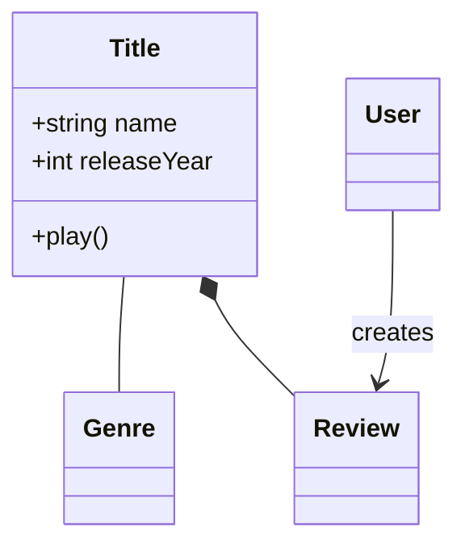
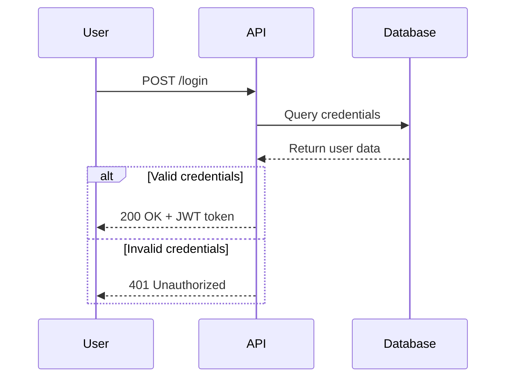
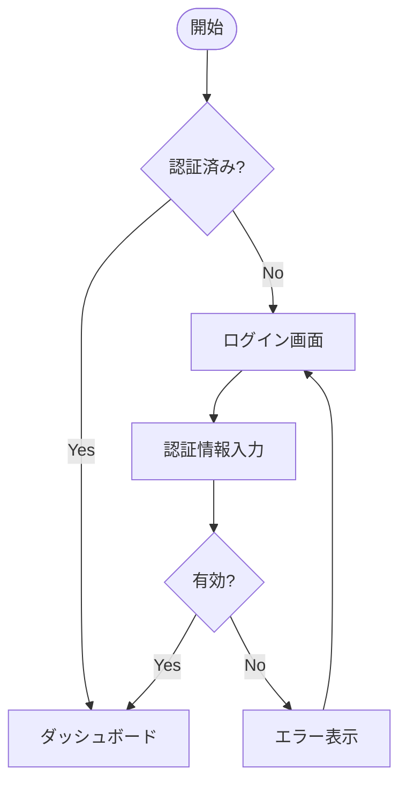
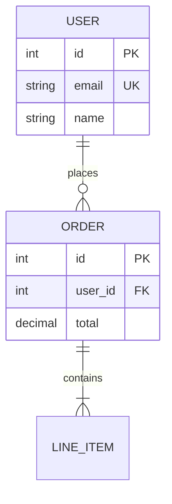
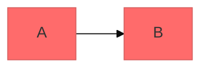

# ダイアグラム作成ガイド

Mermaidとdraw.io MCPを使ってソフトウェア図、アーキテクチャ図、データフロー図を作成するガイド。

---

## ツール選択ガイド

| 状況 | 推奨ツール | 理由 |
|------|----------|------|
| フローチャート・シーケンス図・ER図・クラス図 | **Mermaid** | テキスト記述で信頼性が高く、バージョン管理可能 |
| GitHub/GitLabに埋め込む | **Mermaid** | ネイティブレンダリングサポート |
| 精密なスタイリング・座標指定が必要 | **draw.io XML** | 座標・色・形状を完全制御 |
| 組織図・階層データの可視化 | **draw.io CSV** | スプレッドシート的データから自動レイアウト |
| インタラクティブな編集が必要 | **draw.io MCP** | ブラウザ上でリアルタイム編集 |
| Mermaidで24種類対応 | **Mermaid** | ガントチャート、マインドマップ、タイムライン等 |

**原則**: Mermaidで表現可能ならMermaidを使う。スタイル制御が必要ならdraw.io XML。draw.io MCPはMermaidをdraw.ioで表示・編集する際にも使える。

---

## Mermaid: コア構文

すべてのMermaidダイアグラムは以下のパターンに従う:

```mermaid
diagramType
  definition content
```

- 1行目: ダイアグラムタイプ（`classDiagram`, `sequenceDiagram`, `flowchart`等）
- `%%` でコメント
- 不明なキーワードはダイアグラムを破壊する（Mermaid Liveで構文検証推奨）

### ダイアグラムタイプ一覧（22+種類）

#### 構造・設計
| タイプ | キーワード | 用途 |
|--------|---------|------|
| クラス図 | `classDiagram` | ドメインモデル・OOP設計 |
| ER図 | `erDiagram` | データベーススキーマ |
| C4図 | `C4Context` / `C4Container` | ソフトウェアアーキテクチャ（複数レベル） |
| アーキテクチャ図 | `architecture-beta` | クラウドサービス・インフラ |
| ブロック図 | `block-beta` | コンポーネント構成・階層 |

#### フロー・プロセス
| タイプ | キーワード | 用途 |
|--------|---------|------|
| フローチャート | `flowchart TD/LR` | プロセス・アルゴリズム・決定木 |
| シーケンス図 | `sequenceDiagram` | API通信・認証フロー・メソッド呼び出し |
| 状態遷移図 | `stateDiagram-v2` | アプリ状態・ワークフロー遷移 |
| ユーザーフロー | `journey` | カスタマーエクスペリエンス |

#### プロジェクト管理
| タイプ | キーワード | 用途 |
|--------|---------|------|
| ガントチャート | `gantt` | プロジェクトタイムライン・依存関係 |
| タイムライン | `timeline` | プロダクトロードマップ・履歴 |
| カンバン | `kanban` | スプリント計画・ワークフロー |

#### データ可視化
`pie`, `xychart-beta`, `quadrantChart`, `radar`, `sankey-beta`, `treemap`

#### その他
`gitGraph`（ブランチ戦略）, `mindmap`（ブレインストーミング）, `zenuml`, `packet-beta`

詳細は `references/` の各ファイルを参照。

### クイックスタート例

**クラス図（ドメインモデル）:**


**シーケンス図（API フロー）:**


**フローチャート:**


**ER図:**


### テーマ・設定



利用可能テーマ: `default`, `forest`, `dark`, `neutral`, `base`

レイアウト: `dagre`（デフォルト）/ `elk`（複雑なダイアグラム向け）

---

## draw.io MCP: 概要

**draw.io MCP Server**（`@drawio/mcp`）は、Claude CodeからMCPプロトコル経由でdraw.ioエディタにダイアグラムを送信し、ブラウザ上で表示・編集するツール。

### 利用可能ツール

| ツール | フォーマット | 信頼性 | 用途 |
|--------|------------|-------|------|
| `open_drawio_mermaid` | Mermaid.js | 高 | フローチャート・シーケンス図・ER図（推奨） |
| `open_drawio_xml` | draw.io XML | 高 | 精密スタイリング・座標指定 |
| `open_drawio_csv` | CSV + ディレクティブ | 中 | 組織図・階層データ |

**共通パラメータ:**
- `content` (必須): ダイアグラム内容
- `lightbox` (boolean): 読み取り専用ビュー
- `dark` ("auto"/"true"/"false"): ダークモード制御

### 使用例（draw.io Mermaid）

```
open_drawio_mermaid({
  content: `flowchart LR
    subgraph Client
      A[Browser]
      B[Mobile App]
    end
    subgraph Backend
      C[API Gateway]
      D[Auth Service]
    end
    A --> C
    B --> C
    C --> D`
})
```

### draw.io XML（精密制御）

```
open_drawio_xml({
  content: `<mxGraphModel>
  <root>
    <mxCell id="0"/>
    <mxCell id="1" parent="0"/>
    <mxCell id="2" value="開始"
      style="ellipse;whiteSpace=wrap;html=1;fillColor=#d5e8d4;strokeColor=#82b366;"
      vertex="1" parent="1">
      <mxGeometry x="200" y="40" width="100" height="60" as="geometry"/>
    </mxCell>
  </root>
</mxGraphModel>`
})
```

**XML必須ルール:** `id="0"` と `id="1"` のルートセルは必ず含める。

詳細なフォーマット仕様（XML・CSV・ディレクティブ）は [DRAWIO-FORMATS.md](references/DRAWIO-FORMATS.md) を参照。
CSVディレクティブの詳細は [DRAWIO-CSV-FORMAT.md](references/DRAWIO-CSV-FORMAT.md) を参照。

---

## Mermaid参照ファイル一覧

| カテゴリ | ファイル | 内容 |
|---------|---------|------|
| 構造・設計 | [class-diagrams.md](references/class-diagrams.md) | クラス図・ドメインモデル |
| 構造・設計 | [erd-diagrams.md](references/erd-diagrams.md) | ER図・カーディナリティ |
| 構造・設計 | [c4-diagrams.md](references/c4-diagrams.md) | C4モデル・システムコンテキスト |
| 構造・設計 | [architecture-diagrams.md](references/architecture-diagrams.md) | クラウド・インフラ |
| 構造・設計 | [block-diagrams.md](references/block-diagrams.md) | コンポーネント構成 |
| フロー | [flowcharts.md](references/flowcharts.md) | フローチャート・ノード形状 |
| フロー | [sequence-diagrams.md](references/sequence-diagrams.md) | シーケンス図・ループ・alt |
| フロー | [state-diagrams.md](references/state-diagrams.md) | 状態遷移・FSM |
| フロー | [user-journey-diagrams.md](references/user-journey-diagrams.md) | ユーザーフロー |
| PM | [gantt-charts.md](references/gantt-charts.md) | ガントチャート・依存関係 |
| PM | [timeline-diagrams.md](references/timeline-diagrams.md) | タイムライン・ロードマップ |
| PM | [kanban-diagrams.md](references/kanban-diagrams.md) | カンバンボード |
| データ可視化 | [pie-charts.md](references/pie-charts.md) | 円グラフ |
| データ可視化 | [xy-charts.md](references/xy-charts.md) | 時系列・相関 |
| データ可視化 | [quadrant-charts.md](references/quadrant-charts.md) | 四象限分析 |
| データ可視化 | [radar-charts.md](references/radar-charts.md) | レーダーチャート |
| データ可視化 | [sankey-diagrams.md](references/sankey-diagrams.md) | サンキー図 |
| データ可視化 | [treemap-diagrams.md](references/treemap-diagrams.md) | ツリーマップ |
| バージョン管理 | [git-graphs.md](references/git-graphs.md) | Gitブランチ戦略 |
| 思考整理 | [mindmaps.md](references/mindmaps.md) | マインドマップ |
| 専門 | [zenuml-diagrams.md](references/zenuml-diagrams.md) | ZenUML |
| 専門 | [packet-diagrams.md](references/packet-diagrams.md) | ネットワークプロトコル |
| 高度な機能 | [advanced-features.md](references/advanced-features.md) | テーマ・スタイル・設定 |

---

## ベストプラクティス

1. **シンプルに始める** - コア要素から始め、詳細を段階的に追加
2. **意味のある名前** - ラベルは自己説明的に
3. **コメントを活用** - `%%` コメントで複雑なリレーションを説明
4. **フォーカスを保つ** - 1ダイアグラム1コンセプト。大きなダイアグラムは分割
5. **バージョン管理** - `.mmd` ファイルをコードと一緒に管理
6. **Mermaid Liveで検証** - https://mermaid.live で構文チェック

---

## 出力先・レンダリング

**Mermaid がネイティブサポートされる環境:**
- GitHub/GitLab - Markdownに直接埋め込み可能
- VS Code - Markdown Mermaid拡張でプレビュー
- Notion, Obsidian, Confluence

**エクスポート:**
- Mermaid CLI: `npx @mermaid-js/mermaid-cli -i input.mmd -o output.png`
- draw.io MCP: ブラウザで直接表示・編集
